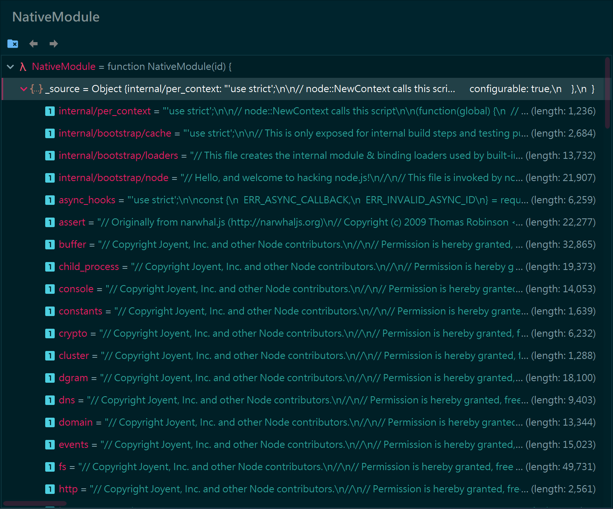

# 浅谈Node.js 下的 Module loader

题目的 idea 来自 [这个问题](https://www.zhihu.com/question/349550048/answer/864295558)

在 Node.js 中，每个文件都视作一个单独的模块，所以我们可以这么写

```js
// index.js
const module1 = require('./module1')

console.log(module1.foo(0))

console.log(module1.goo(0)(0))
```

```js
// module1/index.js
exports.foo = a => a + 114514
exports.goo = b => a => foo
```

在 Node.js 源代码中，我们可以找到 `require` 函数的实现，其中 `id` 是 一个非空 string

```js
// Loads a module at the given file path. Returns that module's
// `exports` property.
Module.prototype.require = function(id) {
  validateString(id, 'id');
  if (id === '') {
    throw new ERR_INVALID_ARG_VALUE('id', id,
                                    'must be a non-empty string');
  }
  requireDepth++;
  try {
    return Module._load(id, this, /* isMain */ false);
  } finally {
    requireDepth--;
  }
};
```

我们可以看到，最顶层会有一个 `requreDepth` 来控制调用深度，具体什么用，我们可以接下来看到

然后 `require` 直接调用 `Module._load`

顺带一提，`Module` 是一个类（JS意义上的类）

```js
function Module(id = '', parent) {
  this.id = id;
  this.path = path.dirname(id);
  this.exports = {};
  this.parent = parent;
  updateChildren(parent, this, false);
  this.filename = null;
  this.loaded = false;
  this.children = [];
}
```

继续看 `_load`

```js
// Check the cache for the requested file.
// 1. If a module already exists in the cache: return its exports object.
// 2. If the module is native: call
//    `NativeModule.prototype.compileForPublicLoader()` and return the exports.
// 3. Otherwise, create a new module for the file and save it to the cache.
//    Then have it load  the file contents before returning its exports
//    object.
Module._load = function(request, parent, isMain) {
    // 一大堆代码，暂时不贴上来
}
```

我们可以从注释中看到，他会先查看缓存中是否有模块，或者是否为 Native 模块，最后才会加载文件

三个参数，第一个是地址，第二个是父地址，第三个是判断是否主文件的boolean

其中，加载 Native 会一直调用到 `src/node_binding.cc`

```cpp
void GetInternalBinding(const FunctionCallbackInfo<Value>& args) {
  Environment* env = Environment::GetCurrent(args);

  CHECK(args[0]->IsString());

  Local<String> module = args[0].As<String>();
  node::Utf8Value module_v(env->isolate(), module);
  Local<Object> exports;

  node_module* mod = get_internal_module(*module_v);
  if (mod != nullptr) {
    exports = InitModule(env, mod, module);
  } else if (!strcmp(*module_v, "constants")) {
    exports = Object::New(env->isolate());
    CHECK(
        exports->SetPrototype(env->context(), Null(env->isolate())).FromJust());
    DefineConstants(env->isolate(), exports);
  } else if (!strcmp(*module_v, "natives")) {
    exports = native_module::NativeModuleEnv::GetSourceObject(env->context());
    // Legacy feature: process.binding('natives').config contains stringified
    // config.gypi
    CHECK(exports
              ->Set(env->context(),
                    env->config_string(),
                    native_module::NativeModuleEnv::GetConfigString(
                        env->isolate()))
              .FromJust());
  } else {
    return ThrowIfNoSuchModule(env, *module_v);
  }

  args.GetReturnValue().Set(exports);
}
```

我们打一个断点看看


```json
{
  "id": ".",
  "exports": {},
  "parent": null,
  "filename": "C:\\Users\\76128\\Desktop\\article\\examples\\02\\src\\index.js",
  "loaded": false,
  "children": [],
  "paths": [
    "C:\\Users\\76128\\Desktop\\article\\examples\\02\\src\\node_modules",
    "C:\\Users\\76128\\Desktop\\article\\examples\\02\\node_modules",
    "C:\\Users\\76128\\Desktop\\article\\examples\\node_modules",
    "C:\\Users\\76128\\Desktop\\article\\node_modules",
    "C:\\Users\\76128\\Desktop\\node_modules",
    "C:\\Users\\76128\\node_modules",
    "C:\\Users\\node_modules",
    "C:\\node_modules"
  ]
}
```

其中的 Module 实例，`paths` 保存了所有能找到的 `node_modules` 黑洞

然后我们断点看到 `NativeModule._source` 里面已经保存了所有的内建代码，所以直接返回 `NativeModule.require(filename)` （如图）

```js
  const mod = loadNativeModule(filename, request, experimentalModules);
  if (mod && mod.canBeRequiredByUsers) return mod.exports;
```



---

我们写一个互相调用的 example

```js
let M
M = require('./module')

console.log(M)
```

```js
// module/index.js
module.exports = {
  ...require('./1'),
  ...require('./2')
}
```

```js
// module/1.js
require('./2')

module.exports = {
  foo: 1
}
```

```js
// module/2.js
require('./1')

module.exports = {
  goo: 2
}
```

第一次加载，没有缓存，他会调用到 `Module.prototype.load`

```js
// Given a file name, pass it to the proper extension handler.
Module.prototype.load = function(filename) {
  debug('load %j for module %j', filename, this.id);

  assert(!this.loaded);
  this.filename = filename;
  this.paths = Module._nodeModulePaths(path.dirname(filename));

  const extension = findLongestRegisteredExtension(filename);
  // allow .mjs to be overridden
  if (filename.endsWith('.mjs') && !Module._extensions['.mjs']) {
    throw new ERR_REQUIRE_ESM(filename);
  }
  Module._extensions[extension](this, filename);
  this.loaded = true;

  if (experimentalModules) {
    const ESMLoader = asyncESM.ESMLoader;
    const url = `${pathToFileURL(filename)}`;
    const module = ESMLoader.moduleMap.get(url);
    // Create module entry at load time to snapshot exports correctly
    const exports = this.exports;
    // Called from cjs translator
    if (module !== undefined && module.module !== undefined) {
      if (module.module.getStatus() >= kInstantiated)
        module.module.setExport('default', exports);
    } else {
      // Preemptively cache
      // We use a function to defer promise creation for async hooks.
      ESMLoader.moduleMap.set(
        url,
        // Module job creation will start promises.
        // We make it a function to lazily trigger those promises
        // for async hooks compatibility.
        () => new ModuleJob(ESMLoader, url, () =>
          new ModuleWrap(url, undefined, ['default'], function() {
            this.setExport('default', exports);
          })
        , false /* isMain */, false /* inspectBrk */)
      );
    }
  }
};
```

默认情况下允许读取 `.js`, `.mjs`, `.node`, `.json`

然后 `.js` 文件调用 `.js` 相关的handle

```js
Module._extensions['.js'] = function(module, filename) {
  // ...省略多余判断
  const content = fs.readFileSync(filename, 'utf8');
  module._compile(content, filename);
};
```

而 `_compiler` 则做了一通检查，然后调用 [`vm.runInThisContext`](https://nodejs.org/dist/latest-v12.x/docs/api/vm.html)，本文不阐述非 module 部分
